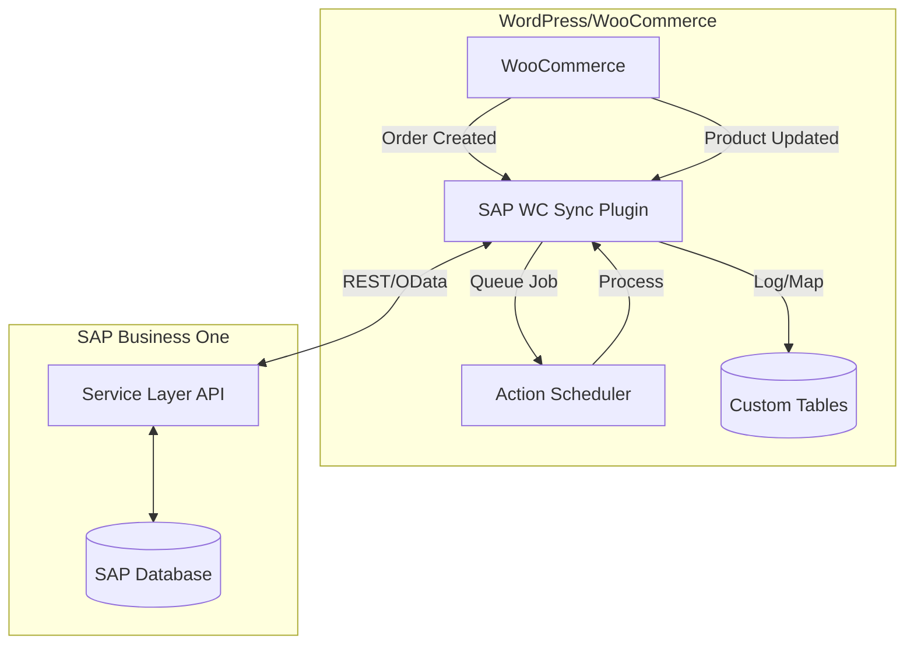
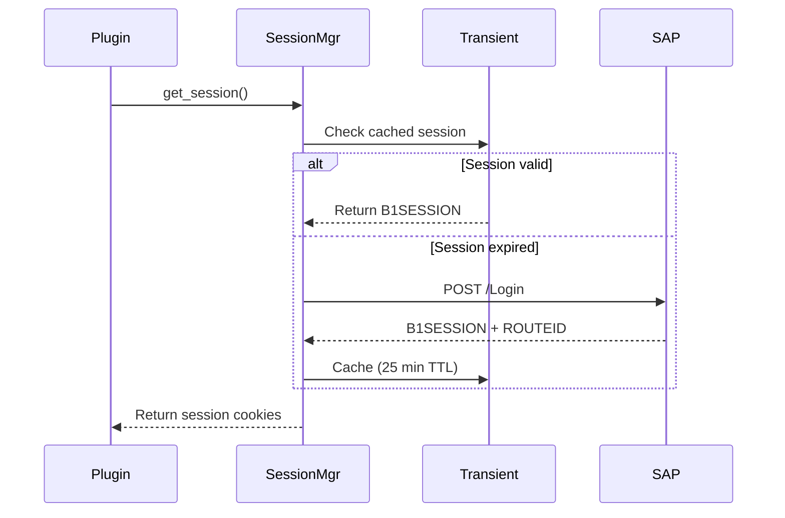

# SAP WooCommerce Sync

[](https://wordpress.org/)
[](https://woocommerce.com/)
[](https://php.net/)
[](https://www.gnu.org/licenses/gpl-2.0.html)

> **Plugin Name:** SAP WooCommerce Sync  
> **Author:** [rasandilikshana](https://github.com/rasandilikshana)  
> **Namespace:** `Rasandilikshana\SAP_WooCommerce_Sync`

Synchronizes inventory, orders, and products between **WooCommerce** and **SAP Business One** via the SAP Service Layer API.

---

## ✨ Features

- 📦 **Stock Synchronization** - Automatically pull stock levels from SAP to WooCommerce
- 🛒 **Order Synchronization** - Push WooCommerce orders to SAP as Sales Orders
- 👥 **Customer Management** - Auto-create SAP Business Partners from WooCommerce customers
- 🔗 **Product Mapping** - Map WooCommerce products to SAP Items via SKU
- ⚙️ **Background Processing** - All sync operations run via Action Scheduler
- 🔄 **Retry Mechanism** - Failed operations retry with exponential backoff
- 📊 **Detailed Logging** - Track all sync operations with filterable logs
- 🔐 **Secure Credentials** - AES-256 encrypted SAP credentials

---

## 🏗️ Architecture Overview



---

## 🔄 Session Management Flow



---

## 📁 Plugin Structure

```
sap-woocommerce-sync/
├── sap-woocommerce-sync.php          # Main plugin file
├── uninstall.php                      # Cleanup on uninstall
├── composer.json                      # Dependencies & autoload
│
├── includes/
│   ├── class-plugin.php               # Main singleton
│   ├── class-activator.php            # Activation logic
│   ├── class-deactivator.php          # Deactivation logic
│   │
│   ├── SAP/                           # SAP Integration
│   │   ├── class-client.php           # HTTP Client with retry
│   │   ├── class-session-manager.php  # Session caching
│   │   ├── class-request-builder.php  # OData query builder
│   │   └── class-response-parser.php  # Response normalization
│   │
│   ├── Sync/                          # Sync Handlers
│   │   ├── class-stock-sync.php       # SAP → WC stock pull
│   │   ├── class-order-sync.php       # WC → SAP order push
│   │   └── class-customer-sync.php    # Customer management
│   │
│   ├── Queue/                         # Background Jobs
│   │   └── class-queue-manager.php    # Action Scheduler wrapper
│   │
│   ├── WooCommerce/                   # WC Hooks
│   │   ├── class-order-hooks.php
│   │   ├── class-product-hooks.php
│   │   └── class-stock-hooks.php
│   │
│   ├── Admin/                         # Admin Interface
│   │   └── class-admin.php            # Settings & Dashboard
│   │
│   ├── Mappers/                       # Data Transformation
│   │   ├── class-order-mapper.php
│   │   └── class-customer-mapper.php
│   │
│   ├── Utilities/                     # Helpers
│   │   ├── class-encryption.php       # AES-256-CBC encryption
│   │   ├── class-logger.php           # Multi-level logging
│   │   ├── class-validator.php        # Input validation
│   │   └── class-helper.php           # Utility functions
│   │
│   └── Exceptions/                    # Custom Exceptions
│       ├── class-sap-exception.php
│       ├── class-connection-exception.php
│       ├── class-authentication-exception.php
│       └── class-validation-exception.php
│
├── templates/admin/                   # Admin Templates
│   ├── dashboard.php
│   ├── settings.php
│   └── logs.php
│
└── assets/                            # CSS & JS
    ├── css/admin.css
    └── js/admin.js
```

---

## 🗄️ Database Schema

| Table | Purpose | Key Columns |
|-------|---------|-------------|
| `wp_sap_wc_sync_log` | All sync operations | type, wc_id, sap_id, status, message |
| `wp_sap_wc_product_map` | WC ↔ SAP products | wc_product_id, sap_item_code |
| `wp_sap_wc_order_map` | WC ↔ SAP orders | wc_order_id, sap_doc_entry |
| `wp_sap_wc_customer_map` | WC ↔ SAP customers | wc_customer_id, sap_card_code |
| `wp_sap_wc_failed_jobs` | Dead letter queue | job_type, payload, error, attempts |

---

## 🔒 Security Features

| Area | Implementation |
|------|----------------|
| **Credentials** | Encrypted with `LOGGED_IN_SALT` + AES-256-CBC |
| **Forms** | Nonce verification on all submissions |
| **Capabilities** | `manage_woocommerce` required |
| **Input** | `sanitize_text_field()`, `absint()`, etc. |
| **Output** | `esc_html()`, `esc_attr()`, `wp_kses()` |
| **SQL** | `$wpdb->prepare()` for all queries |

---

## 📋 Requirements

- **WordPress** 6.0+
- **WooCommerce** 8.0+
- **PHP** 8.0+
- **SAP Business One** 9.3+ with Service Layer enabled
- **SSL Certificate** for SAP connection

---

## 🚀 Installation

1. Clone the repository:
   ```bash
   git clone https://github.com/rasandilikshana/SAP-WooCommerce-Sync.git
   ```

2. Install dependencies:
   ```bash
   cd SAP-WooCommerce-Sync
   composer install
   ```

3. Copy to WordPress plugins directory:
   ```bash
   cp -r SAP-WooCommerce-Sync /path/to/wordpress/wp-content/plugins/sap-woocommerce-sync
   ```

4. Activate in WordPress Admin → Plugins

5. Configure at **WooCommerce → SAP Sync → Settings**

---

## ⚙️ Configuration

### SAP Connection Settings

| Setting | Description |
|---------|-------------|
| Service Layer URL | `https://your-sap-server:50000` |
| Company Database | SAP company DB name (e.g., `SBODEMOUS`) |
| Username | SAP B1 username |
| Password | SAP B1 password (encrypted) |

### Sync Options

| Setting | Description |
|---------|-------------|
| Stock Sync Interval | Minutes between stock syncs (default: 5) |
| Auto Sync Orders | Automatically push new orders to SAP |
| Auto Create Customers | Create Business Partners for new customers |
| Default Warehouse | SAP warehouse code for stock sync |

---

## 🧪 Testing

```bash
# Run all tests
./vendor/bin/phpunit

# Run unit tests only
./vendor/bin/phpunit --testsuite=unit

# Check coding standards
./vendor/bin/phpcs

# Auto-fix coding standards
./vendor/bin/phpcbf
```

---

## 📝 Development Phases

- [x] **Phase 1:** Foundation & Architecture
- [x] **Phase 2:** SAP Service Layer Client
- [x] **Phase 3:** Data Layer & Repositories
- [x] **Phase 4:** Queue & Background Processing
- [x] **Phase 5:** WooCommerce Integration
- [x] **Phase 6:** Admin Interface
- [ ] **Phase 7:** Testing & Documentation

---

## 📄 License

This plugin is licensed under the [GPLv2 or later](https://www.gnu.org/licenses/gpl-2.0.html).

---

## 👨‍💻 Author

**rasandilikshana**

- GitHub: [@rasandilikshana](https://github.com/rasandilikshana)

---

## 🤝 Contributing

Contributions are welcome! Please feel free to submit a Pull Request.

1. Fork the repository
2. Create your feature branch (`git checkout -b feature/amazing-feature`)
3. Commit your changes (`git commit -m 'Add amazing feature'`)
4. Push to the branch (`git push origin feature/amazing-feature`)
5. Open a Pull Request
